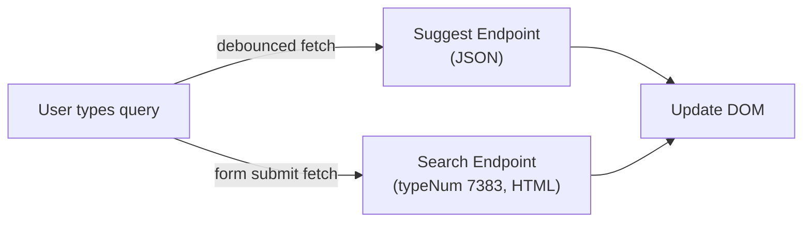

# EXT:solr Frontend: Custom JavaScript Integration

> **Why this supplement?** EXT:solr ships with jQuery-based suggest and AJAX. Modern TYPO3 projects often avoid jQuery. This guide shows how to use EXT:solr's AJAX endpoints with vanilla JavaScript or lightweight frameworks.

## 1. EXT:solr AJAX Endpoints

EXT:solr exposes two key AJAX endpoints via TYPO3 page types:



### typeNum 7383: AJAX Search Results

When configured, requests to `?type=7383&tx_solr[q]=...` return the search results HTML fragment (without page layout). The response replaces the content of `div.tx_solr`.

### Suggest Endpoint

The suggest controller returns JSON with suggestions and optional top results:

```json
{
  "suggestions": {
    "typo3": 42,
    "typo3 solr": 15,
    "typo3 search": 8
  },
  "documents": {
    "doc_1": {
      "title": "Getting Started with Solr",
      "url": "/getting-started",
      "type": "pages",
      "content": "Learn how to set up..."
    }
  }
}
```

### TypoScript Setup

Do NOT include the jQuery TypoScript template. Instead, configure the AJAX page type manually:

```typoscript
plugin.tx_solr_PiResults_Results < tt_content.list.20.solr_pi_results

solr_ajax = PAGE
solr_ajax {
    typeNum = 7383
    config {
        disableAllHeaderCode = 1
        additionalHeaders.10.header = Content-Type: text/html;charset=utf-8
        no_cache = 1
    }
    10 < plugin.tx_solr_PiResults_Results
}
```

## 2. Suggest / Autocomplete with Vanilla JS

Full working example with debouncing, keyboard navigation, and ARIA accessibility:

```javascript
class SolrSuggest {
  constructor(inputSelector, options = {}) {
    this.input = document.querySelector(inputSelector);
    if (!this.input) return;

    this.options = {
      suggestUrl: this.input.dataset.suggestUrl || '/suggest',
      minChars: options.minChars || 3,
      debounceMs: options.debounceMs || 250,
      maxSuggestions: options.maxSuggestions || 10,
    };

    this.activeIndex = -1;
    this.suggestions = [];
    this.debounceTimer = null;

    this.dropdown = document.createElement('ul');
    this.dropdown.setAttribute('role', 'listbox');
    this.dropdown.setAttribute('id', 'solr-suggest-list');
    this.dropdown.classList.add('solr-suggest-dropdown');
    this.dropdown.hidden = true;
    this.input.parentNode.appendChild(this.dropdown);

    this.input.setAttribute('role', 'combobox');
    this.input.setAttribute('aria-autocomplete', 'list');
    this.input.setAttribute('aria-controls', 'solr-suggest-list');
    this.input.setAttribute('aria-expanded', 'false');

    this.input.addEventListener('input', () => this.onInput());
    this.input.addEventListener('keydown', (e) => this.onKeydown(e));
    document.addEventListener('click', (e) => {
      if (!this.input.contains(e.target) && !this.dropdown.contains(e.target)) {
        this.close();
      }
    });
  }

  onInput() {
    clearTimeout(this.debounceTimer);
    const query = this.input.value.trim();

    if (query.length < this.options.minChars) {
      this.close();
      return;
    }

    this.debounceTimer = setTimeout(() => this.fetchSuggestions(query), this.options.debounceMs);
  }

  async fetchSuggestions(query) {
    try {
      const url = new URL(this.options.suggestUrl, window.location.origin);
      url.searchParams.set('tx_solr[queryString]', query);

      const response = await fetch(url.toString(), {
        headers: { 'Accept': 'application/json' },
      });

      if (!response.ok) return;
      const data = await response.json();
      this.render(data);
    } catch (err) {
      console.error('Solr suggest error:', err);
    }
  }

  render(data) {
    this.dropdown.innerHTML = '';
    this.suggestions = [];
    this.activeIndex = -1;

    const terms = Object.keys(data.suggestions || {});
    terms.slice(0, this.options.maxSuggestions).forEach((term, i) => {
      const li = document.createElement('li');
      li.setAttribute('role', 'option');
      li.setAttribute('id', `solr-suggest-${i}`);
      li.textContent = term;
      li.addEventListener('click', () => this.select(term));
      this.dropdown.appendChild(li);
      this.suggestions.push(term);
    });

    if (data.documents) {
      const docs = Object.values(data.documents);
      if (docs.length > 0) {
        const divider = document.createElement('li');
        divider.setAttribute('role', 'separator');
        divider.classList.add('solr-suggest-divider');
        this.dropdown.appendChild(divider);

        docs.forEach((doc) => {
          const li = document.createElement('li');
          li.setAttribute('role', 'option');
          const link = document.createElement('a');
          link.href = doc.url;
          link.textContent = doc.title;
          li.appendChild(link);
          this.dropdown.appendChild(li);
        });
      }
    }

    this.dropdown.hidden = this.suggestions.length === 0;
    this.input.setAttribute('aria-expanded', String(!this.dropdown.hidden));
  }

  onKeydown(e) {
    if (this.dropdown.hidden) return;

    switch (e.key) {
      case 'ArrowDown':
        e.preventDefault();
        this.activeIndex = Math.min(this.activeIndex + 1, this.suggestions.length - 1);
        this.highlight();
        break;
      case 'ArrowUp':
        e.preventDefault();
        this.activeIndex = Math.max(this.activeIndex - 1, -1);
        this.highlight();
        break;
      case 'Enter':
        if (this.activeIndex >= 0) {
          e.preventDefault();
          this.select(this.suggestions[this.activeIndex]);
        }
        break;
      case 'Escape':
        this.close();
        break;
    }
  }

  highlight() {
    this.dropdown.querySelectorAll('[role="option"]').forEach((el, i) => {
      el.classList.toggle('active', i === this.activeIndex);
    });
    if (this.activeIndex >= 0) {
      this.input.setAttribute('aria-activedescendant', `solr-suggest-${this.activeIndex}`);
    } else {
      this.input.removeAttribute('aria-activedescendant');
    }
  }

  select(term) {
    this.input.value = term;
    this.close();
    this.input.closest('form')?.submit();
  }

  close() {
    this.dropdown.hidden = true;
    this.dropdown.innerHTML = '';
    this.activeIndex = -1;
    this.input.setAttribute('aria-expanded', 'false');
    this.input.removeAttribute('aria-activedescendant');
  }
}

document.addEventListener('DOMContentLoaded', () => {
  new SolrSuggest('input[data-solr-suggest]');
});
```

Minimal CSS:

```css
.solr-suggest-dropdown {
  position: absolute;
  z-index: 100;
  background: var(--color-surface, #fff);
  border: 1px solid var(--color-border, #ccc);
  border-radius: 4px;
  list-style: none;
  padding: 0;
  margin: 4px 0 0;
  max-height: 300px;
  overflow-y: auto;
  box-shadow: 0 4px 12px rgba(0, 0, 0, 0.1);
}

.solr-suggest-dropdown [role="option"] {
  padding: 8px 12px;
  cursor: pointer;
}

.solr-suggest-dropdown [role="option"].active,
.solr-suggest-dropdown [role="option"]:hover {
  background: var(--color-primary-light, #e8f0fe);
}

.solr-suggest-divider {
  border-top: 1px solid var(--color-border, #eee);
  margin: 4px 0;
}
```

HTML:

```html
<form action="/search" method="get">
  <div style="position: relative;">
    <input type="search"
           name="tx_solr[q]"
           data-solr-suggest
           data-suggest-url="/index.php?type=7384"
           placeholder="Search..."
           autocomplete="off" />
  </div>
</form>
```

## 3. Facet Filtering with Vanilla JS

Intercept facet links and load results via AJAX:

```javascript
class SolrFacets {
  constructor(containerSelector) {
    this.container = document.querySelector(containerSelector);
    if (!this.container) return;

    this.resultsContainer = document.querySelector('.tx_solr');
    this.bindFacetLinks();
  }

  bindFacetLinks() {
    this.container.addEventListener('click', (e) => {
      const link = e.target.closest('a[data-solr-facet]');
      if (!link) return;

      e.preventDefault();
      this.loadResults(link.href);
    });
  }

  async loadResults(url) {
    this.resultsContainer.classList.add('solr-loading');

    try {
      const ajaxUrl = new URL(url);
      ajaxUrl.searchParams.set('type', '7383');

      const response = await fetch(ajaxUrl.toString());
      if (!response.ok) throw new Error(`HTTP ${response.status}`);

      const html = await response.text();
      this.resultsContainer.innerHTML = html;

      history.pushState(null, '', url);

      this.bindFacetLinks();
    } catch (err) {
      console.error('Solr facet loading error:', err);
    } finally {
      this.resultsContainer.classList.remove('solr-loading');
    }
  }
}

document.addEventListener('DOMContentLoaded', () => {
  new SolrFacets('.solr-facets');
});
```

Add `data-solr-facet` to facet links in your Fluid partial:

```html
<a href="{facetOption.url}" data-solr-facet>{facetOption.label} ({facetOption.count})</a>
```

## 4. Search Results with Vanilla JS

Full AJAX search form without jQuery:

```javascript
class SolrSearch {
  constructor(formSelector) {
    this.form = document.querySelector(formSelector);
    if (!this.form) return;

    this.resultsContainer = document.querySelector('.tx_solr');
    this.form.addEventListener('submit', (e) => this.onSubmit(e));

    window.addEventListener('popstate', () => {
      this.loadResults(window.location.href);
    });
  }

  async onSubmit(e) {
    e.preventDefault();
    const formData = new FormData(this.form);
    const params = new URLSearchParams(formData);
    const url = `${this.form.action}?${params.toString()}`;

    history.pushState(null, '', url);
    await this.loadResults(url);
  }

  async loadResults(url) {
    this.resultsContainer.setAttribute('aria-busy', 'true');
    this.resultsContainer.classList.add('solr-loading');

    try {
      const ajaxUrl = new URL(url, window.location.origin);
      ajaxUrl.searchParams.set('type', '7383');

      const response = await fetch(ajaxUrl.toString());
      if (!response.ok) throw new Error(`HTTP ${response.status}`);

      const html = await response.text();
      this.resultsContainer.innerHTML = html;
    } catch (err) {
      this.resultsContainer.innerHTML =
        '<p class="solr-error">Search is currently not available. Please try again later.</p>';
      console.error('Solr search error:', err);
    } finally {
      this.resultsContainer.setAttribute('aria-busy', 'false');
      this.resultsContainer.classList.remove('solr-loading');
    }
  }
}

document.addEventListener('DOMContentLoaded', () => {
  new SolrSearch('form[data-solr-search]');
});
```

## 5. Removing jQuery Dependency

To use EXT:solr without jQuery:

1. Do **NOT** include the TypoScript template "Search - Ajaxify the searchresults with jQuery"
2. Do **NOT** include the TypoScript template "(Example) Suggest/autocomplete with jquery"
3. Configure the AJAX page type manually (see section 1)
4. Replace `solr-ajaxified` CSS class with `data-solr-*` attributes in your Fluid templates
5. Use the vanilla JS classes from this guide

