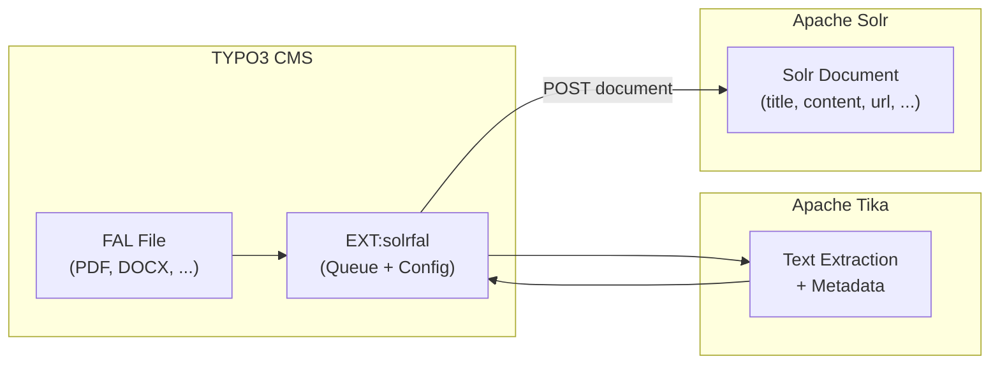

# EXT:solrfal -- File Indexing for Solr

> **Funding Extension:** EXT:solrfal is a funding contribution extension, not open source. It is available to [EB partners](https://www.typo3-solr.com/solr-for-typo3/open-source-version/) and via the [dkd shop](https://shop.dkd.de/).

## 1. What is solrfal?

EXT:solrfal enables indexing of TYPO3 FAL (File Abstraction Layer) files into Apache Solr. It extracts text content from binary files (PDFs, Word documents, spreadsheets, etc.) using Apache Tika, and adds them as searchable documents in Solr.



When files are indexed, search results display differently from page results:
- File title and metadata (MIME type, size, author)
- Link to download the file
- References to pages where the file is used

## 2. Prerequisites

| Component | Version | Required? |
|-----------|---------|-----------|
| EXT:solr | 13.1 | Yes |
| EXT:solrfal | 13.0 | Yes |
| EXT:tika | 13.1 | Yes |
| Apache Tika Server | 3.2.2+ | Yes (CVE-2025-54988 fix) |
| EB Partner access | -- | Yes (funding extension) |

## 3. Installation

```bash
composer require apache-solr-for-typo3/solrfal
composer require apache-solr-for-typo3/tika
```

> EXT:solrfal is not on Packagist. It is distributed via the dkd Composer repository. Add the repository URL provided with your EB partner credentials to `composer.json`.

## 4. Tika Server Setup

The recommended approach is running Tika Server as a Docker container:

```yaml
services:
  tika:
    image: apache/tika:3.2.2
    ports:
      - "9998:9998"
    restart: unless-stopped
```

For DDEV, create `.ddev/docker-compose.tika.yaml`:

```yaml
services:
  tika:
    container_name: ddev-${DDEV_SITENAME}-tika
    image: apache/tika:3.2.2
    restart: "no"
    labels:
      com.ddev.site-name: ${DDEV_SITENAME}
      com.ddev.approot: $DDEV_APPROOT
    expose:
      - "9998"
    environment:
      - VIRTUAL_HOST=$DDEV_HOSTNAME
```

### Configure EXT:tika

1. Open TYPO3 Backend -> Admin Tools -> Settings -> Extension Configuration -> tika
2. Select **"Tika Server"** as the extractor in the General tab
3. Enter connection info in the Server tab:
   - Host: `tika` (Docker service name) or `localhost`
   - Port: `9998`
4. Click **"Check if it works"** to verify the connection

<!-- SCREENSHOT: tika-extension-settings.png - EXT:tika settings in TYPO3 -->

### Alternative: Solr Cell

If you don't want a separate Tika container, use Solr Cell (Tika built into Solr):

1. In EXT:tika settings, select **"Solr Server"** as the extractor
2. Configure the Solr connection (same as EXT:solr)

Limitation: Solr Cell uses the Tika version bundled with Solr, which may be older than the standalone Tika Server.

## 5. Configuration

### Enable File Indexing

File indexing is configured via the EXT:solr Index Queue, attached to content elements or records that reference files:

```typoscript
plugin.tx_solr.index.queue {
    pages {
        attachments {
            fields = media
        }
    }

    news {
        attachments {
            fields = related_files
        }
    }
}
```

The `attachments.fields` setting specifies which FAL relation fields contain files to index.

### Supported File Types

Tika can extract text from ~600 file formats. The most common:

| Format | MIME Type | Extracted Content |
|--------|----------|-------------------|
| PDF | `application/pdf` | Text, metadata, embedded images (text only) |
| DOCX | `application/vnd.openxmlformats-officedocument.wordprocessingml.document` | Text, metadata |
| XLSX | `application/vnd.openxmlformats-officedocument.spreadsheetml.sheet` | Cell content, metadata |
| PPTX | `application/vnd.openxmlformats-officedocument.presentationml.presentation` | Slide text, notes |
| ODT | `application/vnd.oasis.opendocument.text` | Text, metadata |
| RTF | `application/rtf` | Text |
| TXT | `text/plain` | Raw text |
| HTML | `text/html` | Stripped text |
| MSG | `application/vnd.ms-outlook` | Email body, metadata |

### File Size Limits

Large files can cause timeouts or memory issues. Configure limits in EXT:tika extension settings:
- **Maximum file size:** Set a reasonable limit (e.g., 20 MB) to prevent Tika timeouts
- **Tika timeout:** Increase the server timeout for large documents

## 6. Index Queue for Files

Files enter the Index Queue when:
- A content element or record with file references is created/edited
- The file reference field is in the `attachments.fields` configuration
- The file type is extractable by Tika

Files are processed by the same "Index Queue Worker" scheduler task as regular records.

### How File Documents Look in Solr

File documents in Solr contain:
- `type`: `tx_solrfal_file` (or similar, depending on configuration)
- `title`: File name or extracted title metadata
- `content`: Extracted text content from Tika
- `url`: Download URL for the file
- `fileReferenceUid_intS`: UID of the FAL file reference
- `mimeType_stringS`: MIME type of the file
- Standard fields: `siteHash`, `access`, `pid`, etc.

## 7. Troubleshooting

### Tika Connection Issues

| Symptom | Fix |
|---------|-----|
| "Connection refused" to Tika | Check Docker container is running: `docker ps \| grep tika` |
| Timeout on large files | Increase Tika Server timeout, reduce max file size |
| "Unsupported Media Type" | File format not supported by Tika, check MIME type |
| Empty content extracted | File may be scanned image (needs OCR), or password-protected |

### DDEV-Specific

In DDEV, the Tika service name is `tika` (use this as hostname). Test connectivity:

```bash
ddev exec curl -s http://tika:9998/tika
```

### Files Not Appearing in Search Results

1. Check `attachments.fields` in TypoScript includes the correct FAL field name
2. Verify the file type is supported by Tika
3. Check the Index Queue for file items and error messages
4. Query Solr Admin: `q=*:*&fq=type:tx_solrfal_file&fl=uid,title,content,mimeType_stringS`
5. Ensure the Scheduler worker has processed file items

### Performance

- Index files during off-peak hours (Tika extraction is CPU-intensive)
- Use the two-pass indexing approach: index records first, then process files
- Monitor Tika Server memory usage for large document collections

## 8. Testing

### Verify Tika Extraction

Test Tika directly:

```bash
# Send a PDF to Tika and get extracted text
curl -T /path/to/test.pdf http://tika:9998/tika --header "Accept: text/plain"

# Get metadata
curl -T /path/to/test.pdf http://tika:9998/meta --header "Accept: application/json"
```

### Verify Solr Documents

After indexing, check file documents in Solr Admin:

```
q=*:*&fq=type:tx_solrfal_file&rows=5&fl=uid,title,content,mimeType_stringS,url
```

### Functional Test

```php
<?php

declare(strict_types=1);

namespace MyVendor\MyExt\Tests\Functional;

use TYPO3\TestingFramework\Core\Functional\FunctionalTestCase;

final class FileIndexingTest extends FunctionalTestCase
{
    protected array $testExtensionsToLoad = [
        'apache-solr-for-typo3/solr',
        'apache-solr-for-typo3/tika',
        'apache-solr-for-typo3/solrfal',
    ];

    public function testPdfFileIsQueued(): void
    {
        $this->importCSVDataSet(__DIR__ . '/Fixtures/page_with_pdf.csv');

        // Verify the file appears in the index queue
        $queryBuilder = $this->getConnectionPool()
            ->getQueryBuilderForTable('tx_solr_indexqueue_item');
        $count = $queryBuilder
            ->count('uid')
            ->from('tx_solr_indexqueue_item')
            ->where($queryBuilder->expr()->like('item_type', $queryBuilder->createNamedParameter('%file%')))
            ->executeQuery()
            ->fetchOne();

        self::assertGreaterThan(0, $count, 'PDF file should be in index queue');
    }
}
```
