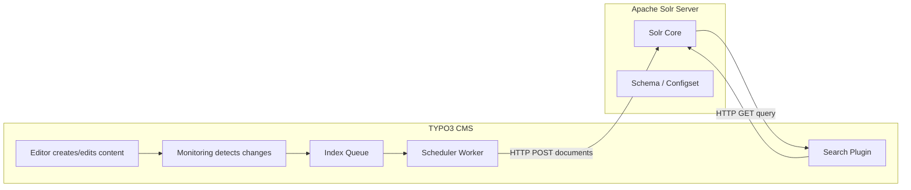
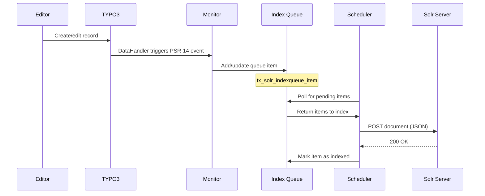
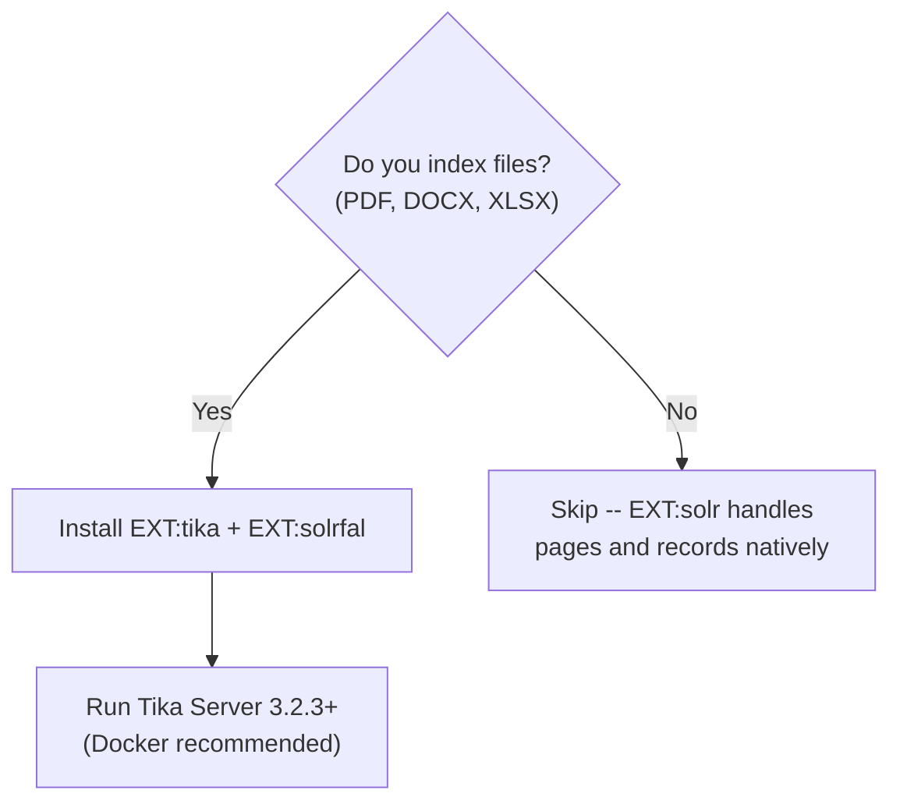

# Apache Solr for TYPO3

> Source: https://github.com/dirnbauer/webconsulting-skills

> **Compatibility:** This skill targets **TYPO3 v14.x**. Match **EXT:solr** (and Solr server version) using the [official Version Matrix](https://docs.typo3.org/p/apache-solr-for-typo3/solr/main/en-us/Appendix/VersionMatrix.html) and Packagist — `14.0.x` availability may lag docs; use the branch/matrix the project documents until a stable tag ships.
> All custom PHP examples use TYPO3 v14 conventions (PHP 8.2+, constructor promotion, `#[AsEventListener]` where shown).

> **TYPO3 API First:** Always use TYPO3's built-in APIs and EXT:solr's TypoScript/PSR-14 events before creating custom implementations. Do not reinvent what EXT:solr already provides.

## Sources

This skill is based on the following authoritative sources:

1. [EXT:solr Documentation](https://docs.typo3.org/p/apache-solr-for-typo3/solr/main/en-us/)
2. [EXT:tika Documentation](https://docs.typo3.org/p/apache-solr-for-typo3/tika/main/en-us/)
3. [Version Matrix](https://docs.typo3.org/p/apache-solr-for-typo3/solr/main/en-us/Appendix/VersionMatrix.html)
4. [GitHub: TYPO3-Solr/ext-solr](https://github.com/TYPO3-Solr/ext-solr)
5. [GitHub: main branch (14.0.x-dev)](https://github.com/TYPO3-Solr/ext-solr/tree/main)
6. [Apache Solr Reference Guide](https://solr.apache.org/guide/solr/latest/)
7. [Solr Dense Vector Search](https://solr.apache.org/guide/solr/latest/query-guide/dense-vector-search.html)
8. [Solr Text to Vector (LLM)](https://solr.apache.org/guide/solr/latest/query-guide/text-to-vector.html)
9. [typo3-solr.com](https://www.typo3-solr.com/)
10. [hosted-solr.com](https://hosted-solr.com/en/)
11. [ddev-typo3-solr](https://github.com/ddev/ddev-typo3-solr)
12. [Mittwald Solr Docs](https://developer.mittwald.de/docs/v2/platform/databases/solr/)
13. [helhum/dotenv-connector](https://github.com/helhum/dotenv-connector)

## 1. Architecture Overview

EXT:solr connects TYPO3 CMS to an Apache Solr search server, providing full-text search, faceted navigation, autocomplete, and (on supported **Solr 9.x** builds) dense-vector / semantic features where enabled.



### Document Lifecycle



### Component Overview

| Component | Package | Purpose | Required? |
|-----------|---------|---------|-----------|
| **EXT:solr** | `apache-solr-for-typo3/solr` | Core search integration | Yes |
| **EXT:tika** | `apache-solr-for-typo3/tika` | Text/metadata extraction from files | Only for file indexing |
| **EXT:solrfal** | Funding extension | FAL file indexing into Solr | Only for file indexing |
| **EXT:solrconsole** | Funding extension | Backend management console | Optional |
| **EXT:solrdebugtools** | Funding extension | Query debugging, score analysis | Optional (recommended for dev) |

<!-- SCREENSHOT: backend-module-overview.png - EXT:solr backend module main view -->

## 2. Version compatibility matrix (upstream)

**Target for this skill:** TYPO3 **v14.x** with the **EXT:solr** release row that matches your Core on the [official Version Matrix](https://docs.typo3.org/p/apache-solr-for-typo3/solr/main/en-us/Appendix/VersionMatrix.html). Older rows are **reference only** for legacy sites.

| EXT:solr | TYPO3 | Apache Solr | Configset | PHP | EXT:tika | EXT:solrfal |
|----------|-------|-------------|-----------|-----|----------|-------------|
| **14.0.x** (see matrix / Packagist) | **14.x** | per matrix | `ext_solr_14_0_0` (when used) | **^8.2** | per matrix | per matrix |
| 13.1.x | *(not a target for this collection)* | 9.10.1 | `ext_solr_13_1_0` | ^8.2 | 13.1 | 13.0 |

When **14.0.x** is not yet on Packagist, follow the **TYPO3 v14 Readiness** subsection below (`dev-main` / docs workflow) until a stable tag ships.

### TYPO3 v14 Readiness

The [Version Matrix](https://docs.typo3.org/p/apache-solr-for-typo3/solr/main/en-us/Appendix/VersionMatrix.html) targets **TYPO3 14.3 + EXT:solr 14.0 + Solr 9.10.1 + `ext_solr_14_0_0`**. Upstream development is on [`main`](https://github.com/TYPO3-Solr/ext-solr/tree/main):

- `main` requires `typo3/cms-core: 14.*.*@dev` (see `composer.json` on `main`)
- branch alias **`dev-main` -> `14.0.x-dev`**
- **Composer reality check:** if Packagist has no `14.0.x` stable yet, use `dev-main` (often requires `minimum-stability: dev` + `prefer-stable: true`) or the GitHub release ZIP workflow documented by EXT:solr for non-TER packages.

**Until `14.0` is published on Packagist:**

```bash
composer require apache-solr-for-typo3/solr:dev-main
```

> **Warning:** Re-check Packagist/GitHub when you upgrade — switch from `dev-main` to a tagged `^14.0` constraint as soon as stable releases exist.

### CVE-2025-24814 Migration

Apache Solr 9.8.0+ disables loading `jar` files via `lib` directive in configsets. **CVE-2025-24814** is a remote-code-execution class issue: if an attacker can replace or supply a configset file that Solr treats as trusted, Solr may load attacker-controlled JARs from that configset (including via the `lib` directive), which can lead to arbitrary code execution. The stricter default blocks that classpath loading from configsets. The `solr-typo3-plugin` must be moved from `/configsets/ext_solr_*/typo3lib/` to `/typo3lib/` at the Solr server root. Docker users: use the **EXT:solr** container image **13.0.1+** (image tag, not TYPO3 Core) so this migration runs automatically.

## 3. Installation & Setup

### Composer

```bash
composer require apache-solr-for-typo3/solr
```

### DDEV Setup

The recommended local development setup uses the [ddev-typo3-solr](https://github.com/ddev/ddev-typo3-solr) addon:

```bash
ddev add-on get ddev/ddev-typo3-solr
ddev restart
```

> **Solr image version:** the DDEV Solr add-on defaults `SOLR_BASE_IMAGE` to `solr:9.10`, and the generated compose file is `.ddev/docker-compose.typo3-solr.yaml`. For explicit control, override via `.ddev/.env.solr` (for example: `ddev dotenv set .ddev/.env.solr --solr-base-image="solr:9.10.1"`) and rebuild the Solr service.

Configure `.ddev/typo3-solr/config.yaml`:

```yaml
config: 'vendor/apache-solr-for-typo3/solr/Resources/Private/Solr/solr.xml'
typo3lib: 'vendor/apache-solr-for-typo3/solr/Resources/Private/Solr/typo3lib'
configsets:
  - name: 'ext_solr_14_0_0'
    path: 'vendor/apache-solr-for-typo3/solr/Resources/Private/Solr/configsets/ext_solr_14_0_0'
    cores:
      - name: 'core_en'
        schema: 'english/schema.xml'
      - name: 'core_de'
        schema: 'german/schema.xml'
```

Auto-initialize cores on boot in `.ddev/config.yaml`:

```yaml
hooks:
  post-start:
    - exec-host: ddev solrctl apply
```

**Useful DDEV commands:**

| Command | Description |
|---------|-------------|
| `ddev solrctl apply` | Create cores from config |
| `ddev solrctl wipe` | Delete all cores |
| `ddev exec -s typo3-solr solr --version` | Check Solr version inside the Solr service |
| `ddev launch :8984` | Open Solr Admin UI |
| `ddev logs -s typo3-solr` | View Solr logs |

<!-- SCREENSHOT: ddev-solr-admin.png - DDEV Solr Admin at :8984 -->

### Docker (Production)

```yaml
services:
  solr:
    # Note: as of March 2026, no stable 14.0 tag exists on Docker Hub.
    # Use 14.0.x-dev for testing, or 13.1 for production until 14.0 ships.
    image: typo3solr/ext-solr:14.0.x-dev
    ports:
      - "8983:8983"
    volumes:
      - solr-data:/var/solr
    restart: unless-stopped

volumes:
  solr-data:
    driver: local
```

The image ships default cores for all languages. Persistent data is stored at `/var/solr` (owned by UID 8983).

### Standalone Solr

Deploy the configset from EXT:solr into your Solr installation:

```bash
cp -r vendor/apache-solr-for-typo3/solr/Resources/Private/Solr/* $SOLR_INSTALL_DIR/server/solr/
```

Create cores via `core.properties` files, `solrctl`, or the Solr Admin API. **Payload shape differs by Solr major** (v8 vs v9 “v2” APIs) — treat any one-liner `curl` as illustrative and follow the Solr version you run.

```bash
# Illustrative only — confirm against your Solr admin API docs / use bin/solr or ddev solrctl for local setups
curl -sS -X POST "http://localhost:8983/solr/admin/cores?action=CREATE&name=core_en&configSet=ext_solr_14_0_0"
```

### Managed Hosting: Mittwald

Mittwald provides a managed Solr service via their container platform. Use the Terraform module:

```hcl
module "solr" {
  source         = "mittwald/solr/mittwald"
  solr_version   = "9"
  solr_core_name = "typo3"
  solr_heap      = "2g"
}
```

Access Solr at `http://typo3-solr:8983` inside the container. For local debugging:

```bash
mw container port-forward --port 8983
```

### Managed Hosting: hosted-solr.com

[hosted-solr.com](https://hosted-solr.com/en/) by dkd provides pre-configured Solr cores optimized for EXT:solr. As of the live pricing page, the **Small** plan is **10,00 EUR/month** (2 Solr indexes, 4.000 documents; VAT note on site). After creating a core, configure it in your TYPO3 site config using the provided host, port, and path.

### TYPO3 Site Configuration

In `config/sites/<identifier>/config.yaml`:

```yaml
solr_enabled_read: true
solr_host_read: solr
solr_port_read: '8983'
solr_scheme_read: http
solr_path_read: /
solr_core_read: core_en
```

For DDEV, use the DDEV hostname and HTTPS port:

```yaml
solr_host_read: <project>.ddev.site
solr_port_read: '8984'
solr_scheme_read: https
```

<!-- SCREENSHOT: reports-module-solr.png - TYPO3 Reports module Solr status -->

### Environment Configuration (helhum/dotenv-connector)

Never hardcode Solr connection details. Use [helhum/dotenv-connector](https://github.com/helhum/dotenv-connector) for per-environment configuration:

```bash
composer require helhum/dotenv-connector
```

`.env` (gitignored):

```env
SOLR_HOST=solr
SOLR_PORT=8983
SOLR_SCHEME=http
SOLR_PATH=/
SOLR_CORE_EN=core_en
SOLR_CORE_DE=core_de
```

`.env.example` (committed to VCS):

```env
SOLR_HOST=solr
SOLR_PORT=8983
SOLR_SCHEME=http
SOLR_PATH=/
SOLR_CORE_EN=core_en
SOLR_CORE_DE=core_de
```

In `config/system/additional.php`, override site config values programmatically or use a post-processing approach. For simple setups, keep `.env` values and reference them in deployment scripts that generate site config YAML per environment.

## 4. EXT:tika -- When You Need It (and When Not)

EXT:tika integrates Apache Tika for metadata extraction, language detection, and text extraction from over 1,000 file formats.



**Three backends (choose one):**

| Backend | Recommended? | Setup |
|---------|-------------|-------|
| **Tika Server** | Yes | Standalone Docker container, newest Tika version |
| **Solr Cell** | Acceptable | Uses Tika built into Solr, no extra service needed |
| **Tika App** | Deprecated | Requires Java on webserver, do not use |

**When you NEED EXT:tika:**
- File indexing via EXT:solrfal (search inside PDFs, Word documents, etc.)
- Automatic FAL metadata enrichment (EXIF, XMP, document properties)
- Language detection on uploaded files

**When you DON'T need it:**
- Only indexing pages and structured records (news, events, products) via Index Queue
- EXT:solr handles page content and record fields natively without Tika

**Version:** EXT:tika **13.1** (the current v13 release) requires Apache Tika Server/App **3.2.3+**. A v14-compatible EXT:tika release is not yet available on the official Version Matrix — track Packagist and GitHub for updates. For Apache Tika and Solr security advisories, verify on [Apache Solr security](https://solr.apache.org/security.html) / vendor advisories.

See [SKILL-SOLRFAL.md](SKILL-SOLRFAL.md) for complete file indexing setup.


## Detailed Reference

Read [the full guide](references/full-guide.md) when the task needs detailed examples, long templates, troubleshooting matrices, appendices, or sections not included above. Keep this file unloaded for narrow tasks so the skill follows progressive disclosure.
