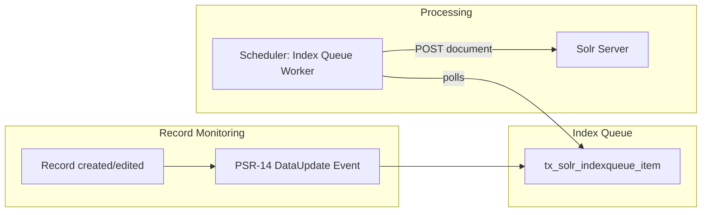

# 6. Index Queue Configuration

Continues `typo3-solr` from [full guide](full-guide.md).

## 6. Index Queue Configuration

The Index Queue is the central mechanism for getting TYPO3 records into Solr.



### Pages

Pages are indexed out of the box. No additional configuration needed. The page indexer sends the rendered page content to Solr.

### Custom Records

Index any TYPO3 record table via TypoScript. Full example for EXT:news:

```typoscript
plugin.tx_solr.index.queue {
    news = 1
    news {
        type = tx_news_domain_model_news

        fields {
            abstract = teaser
            author = author
            authorEmail_stringS = author_email
            title = title

            content = SOLR_CONTENT
            content {
                cObject = COA
                cObject {
                    10 = TEXT
                    10 {
                        field = bodytext
                        noTrimWrap = || |
                    }
                }
            }

            category_stringM = SOLR_RELATION
            category_stringM {
                localField = categories
                multiValue = 1
            }

            keywords = SOLR_MULTIVALUE
            keywords {
                field = keywords
            }

            tags_stringM = SOLR_RELATION
            tags_stringM {
                localField = tags
                multiValue = 1
            }

            url = TEXT
            url {
                typolink.parameter = {$plugin.tx_news.settings.detailPid}
                typolink.additionalParams = &tx_news_pi1[controller]=News&tx_news_pi1[action]=detail&tx_news_pi1[news]={field:uid}
                typolink.additionalParams.insertData = 1
                typolink.returnLast = url
            }
        }

        attachments {
            # news v14: the FAL relation column is `fal_related_files` (there is no plain `related_files` column)
            fields = fal_related_files
        }
    }
}
```

### Content Objects

| Object | Purpose |
|--------|---------|
| `SOLR_CONTENT` | Strips HTML/RTE from field content |
| `SOLR_RELATION` | Resolves relations (categories, tags, etc.), supports `multiValue = 1` |
| `SOLR_MULTIVALUE` | Splits a comma-separated field into multiple values |

### Records Outside Siteroot

To index records stored in sysfolders outside the site tree:

```typoscript
plugin.tx_solr.index.queue.news {
    additionalPageIds = 45,48
}
```

Enable monitoring in Extension Settings: "Enable tracking of records outside siteroot".

### Monitoring

EXT:solr detects record changes via PSR-14 events. Two modes:

- **Immediate** (default): changes are processed directly during the DataHandler operation
- **Delayed**: changes are queued in `tx_solr_eventqueue_item` and processed by a scheduler task ("Event Queue Worker")

Configure via Extension Settings: `monitoringType`.

<!-- SCREENSHOT: index-queue-tab.png - Backend module Index Queue tab -->
