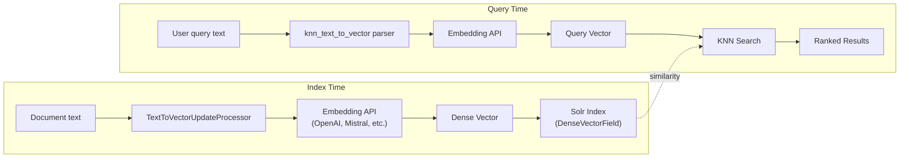

# 11. LLM & Vector Search (Solr Server Native)

Continues `typo3-solr` from [full guide](full-guide.md).

## 11. LLM & Vector Search (Solr Server Native)

**KNN / dense vectors** exist from **Solr 9.0+**; **text-to-vector** / LLM integrations use the **`language-models`** (or successor) module on **newer 9.x** releases — confirm module names for your Solr version. This runs on the **Solr server** — EXT:solr only issues queries.



### Prerequisites

- Apache Solr **9.x** (matrix per EXT:solr version guide) with the appropriate **vector / language-model** modules enabled (see [Solr modules](https://solr.apache.org/guide/solr/latest/configuration-guide/solr-modules.html))
- An external embedding API / model registered in Solr's text-to-vector model store (LangChain4j-backed in current Solr docs)

### Schema: DenseVectorField

Add to your schema (or use a custom configset):

```xml
<fieldType name="knn_vector" class="solr.DenseVectorField"
           vectorDimension="1536"
           similarityFunction="cosine"
           knnAlgorithm="hnsw"/>

<field name="vector" type="knn_vector" indexed="true" stored="true"/>
```

`vectorDimension` must match your embedding model (e.g., OpenAI `text-embedding-3-small` = 1536 dimensions).

### Model Configuration

Register the query parser in `solrconfig.xml`:

```xml
<queryParser name="knn_text_to_vector"
             class="org.apache.solr.languagemodels.textvectorisation.search.TextToVectorQParserPlugin"/>
```

Upload a model definition:

```bash
curl -XPUT 'http://localhost:8983/solr/core_en/schema/text-to-vector-model-store' \
  --data-binary @model.json -H 'Content-type:application/json'
```

`model.json` (OpenAI example):

```json
{
  "class": "dev.langchain4j.model.openai.OpenAiEmbeddingModel",
  "name": "openai-embed",
  "params": {
    "baseUrl": "https://api.openai.com/v1",
    "apiKey": "sk-...",
    "modelName": "text-embedding-3-small",
    "timeout": 60,
    "maxRetries": 3
  }
}
```

Current Solr text-to-vector documentation lists OpenAI, Mistral AI, Cohere, and Hugging Face models via LangChain4j support. Verify the exact provider set against the Solr version you deploy. See [LangChain4j Embedding Models](https://docs.langchain4j.dev/category/embedding-models) for model-specific parameters.

### Indexing with Vectors

Add an update processor chain in `solrconfig.xml`:

```xml
<updateRequestProcessorChain name="vectorisation">
  <processor class="solr.languagemodels.textvectorisation.update.processor.TextToVectorUpdateProcessorFactory">
    <str name="inputField">_text_</str>
    <str name="outputField">vector</str>
    <str name="model">openai-embed</str>
  </processor>
  <processor class="solr.RunUpdateProcessorFactory"/>
</updateRequestProcessorChain>
```

**Two-pass strategy** (recommended for production): index documents normally first, then enrich with vectors in a second pass to avoid blocking the indexing pipeline with slow API calls.

### Querying

**Semantic search** (text in, vector out):

```
?q={!knn_text_to_vector model=openai-embed f=vector topK=10}customer complaints handling
```

**Raw vector search:**

```
?q={!knn f=vector topK=10}[0.1, 0.2, 0.3, ...]
```

**Threshold search** (all documents above similarity):

```
?q={!vectorSimilarity f=vector minReturn=0.7}[0.1, 0.2, 0.3, ...]
```

**Hybrid search** (BM25 + vector re-ranking):

```
?q=customer complaints
&rq={!rerank reRankQuery=$rqq reRankDocs=50 reRankWeight=2}
&rqq={!knn_text_to_vector model=openai-embed f=vector topK=50}customer complaints
```

### Pre-Filtering

Combine vector search with traditional filters:

```
?q={!knn_text_to_vector model=openai-embed f=vector topK=10 preFilter=type:pages}search query
```

### EXT:solr Integration

Vector-search-related support in the EXT:solr 13.1.x / 14.0 line is still evolving. For custom integration, use a PSR-14 event listener on `BeforeDocumentsAreIndexedEvent` to add vector data to documents via your own embedding service call.

> **Note:** Full native vector search support in EXT:solr (Index Queue -> vector fields, Fluid templates for vector results) is still evolving. Monitor the [GitHub repository](https://github.com/TYPO3-Solr/ext-solr) for updates.

### Use Cases

| Use Case | Approach |
|----------|----------|
| **Smart site search** | `knn_text_to_vector` finds semantically similar content |
| **Similar content** | Given a document's vector, find K nearest neighbors |
| **Multilingual bridge** | Embeddings can match across languages |
| **FAQ matching** | Match user questions to FAQ answers despite different wording |
| **RAG preparation** | Use Solr as retrieval layer for LLM-powered Q&A |
| **File discovery** | Combined with solrfal + Tika: semantic search over documents |
