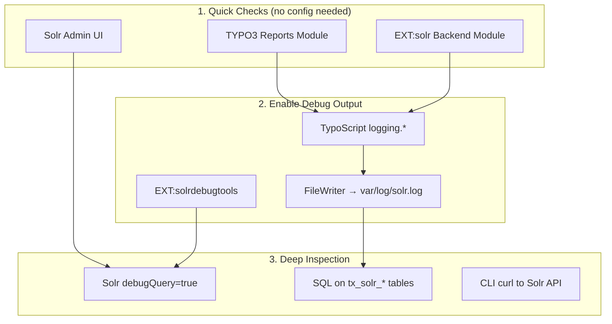
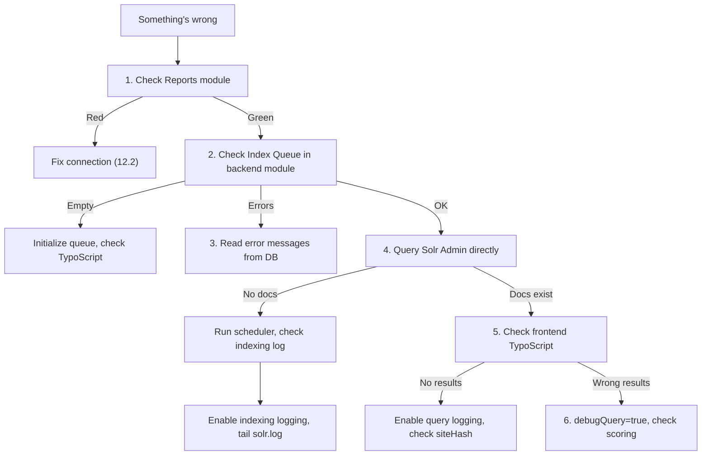
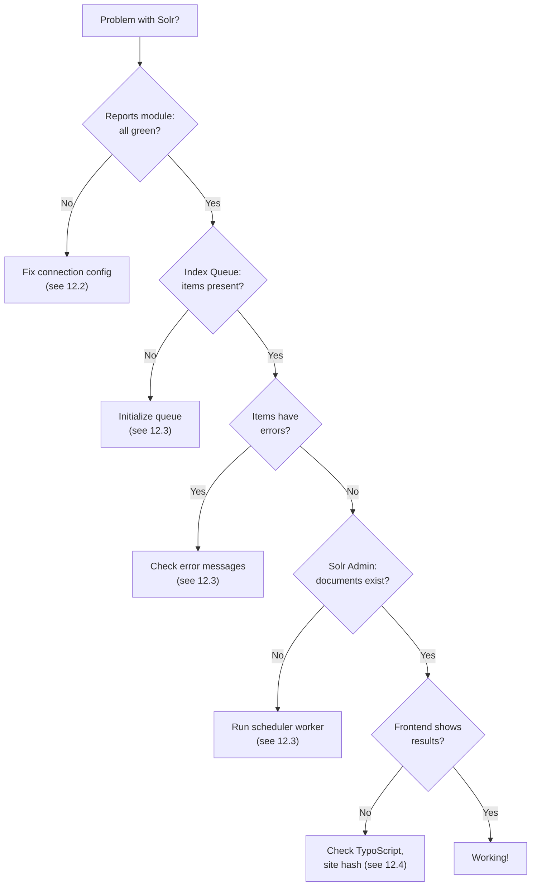
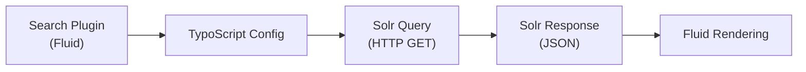

# 12.0 How to Get Debug Data

Continues `typo3-solr` from [full guide](full-guide.md).

### 12.0 How to Get Debug Data

Before you can fix anything, you need to **see** what EXT:solr is doing. There are six layers of debug data, from quick checks to deep inspection:



#### Layer 1: Quick checks (zero configuration)

**TYPO3 Reports module** (Admin Tools -> Reports -> Status Report):
- Shows connection status, configset match, core availability per language
- If anything is red/yellow here, fix it before debugging further

**EXT:solr backend module** (Web -> Search):
- **Overview tab**: connection status per site and language
- **Index Queue tab**: record counts by type, error counts, last indexed timestamp
- **Index Fields tab**: all fields in the Solr schema with types and stored/indexed flags
- **Stop Words / Synonyms tabs**: current configuration on the Solr core

**Solr Admin UI** (DDEV: `ddev launch :8984`, Production: `http://host:8983/solr/`):
- **Dashboard**: JVM memory, Solr version, uptime
- **Core Selector** (dropdown): pick the core you want to inspect
- **Query tab**: run queries directly against the core
- **Schema Browser**: inspect field types, stored/indexed flags, sample values
- **Analysis tab**: paste text to see how Solr tokenizes and stems it

#### Layer 2: Enable TypoScript debug logging

Add to your **root page TypoScript setup** (dev/staging only):

```typoscript
plugin.tx_solr.logging {
    debugOutput = 1
    exceptions = 1

    indexing = 1
    indexing.indexQueueInitialization = 1
    indexing.pageIndexed = 1
    indexing.queue.news = 1

    query.rawGet = 1
    query.rawPost = 1
    query.queryString = 1
    query.searchWords = 1
}
```

| Setting | What it logs |
|---------|-------------|
| `debugOutput` | Writes debug info to the TYPO3 devlog |
| `exceptions` | Full exception stack traces from Solr communication |
| `indexing` | Every document sent to Solr during indexing |
| `indexing.indexQueueInitialization` | Which tables were initialized into the queue |
| `indexing.pageIndexed` | Each page after it was indexed (URL, fields, response) |
| `indexing.queue.<name>` | Per-config logging (e.g., `queue.news`, `queue.events`) |
| `query.rawGet` | The exact HTTP GET URL sent to Solr |
| `query.rawPost` | POST body sent to Solr (for complex queries) |
| `query.queryString` | The parsed Solr query string |
| `query.searchWords` | The user's search input after processing |

**Where does the output go?** By default, to the TYPO3 logging system. To get a file you can `tail -f`:

```php
// config/system/additional.php
$GLOBALS['TYPO3_CONF_VARS']['LOG']['ApacheSolrForTypo3']['Solr']['writerConfiguration'] = [
    \Psr\Log\LogLevel::DEBUG => [
        \TYPO3\CMS\Core\Log\Writer\FileWriter::class => [
            'logFile' => \TYPO3\CMS\Core\Core\Environment::getVarPath() . '/log/solr.log',
        ],
    ],
];
```

Then watch live:

```bash
# DDEV
ddev exec tail -f var/log/solr.log

# Standalone
tail -f /var/www/html/var/log/solr.log
```

**Also check the TYPO3 system log:** Admin Tools -> Log module, filter by component `ApacheSolrForTypo3`.

#### Layer 3: Solr debugQuery (score explanation)

In Solr Admin UI -> Query tab, add `debugQuery=true` to see **why** a document ranks where it does:

```
q=typo3 solr&debugQuery=true&fl=uid,title,score
```

The response includes a `debug` section:

```json
{
  "debug": {
    "rawquerystring": "typo3 solr",
    "querystring": "typo3 solr",
    "parsedquery": "(title:typo3 | content:typo3) (title:solr | content:solr)",
    "QParser": "ExtendedDismaxQParser",
    "explain": {
      "4f547484...": "\n7.256 = sum of:\n  3.628 = weight(title:typo3) ...\n  3.628 = weight(title:solr) ..."
    },
    "timing": {
      "time": 2.0,
      "prepare": { "time": 1.0 },
      "process": { "time": 1.0 }
    }
  }
}
```

Key fields in the debug response:

| Field | What it tells you |
|-------|-------------------|
| `parsedquery` | How Solr interpreted your search terms (which fields, operators) |
| `explain` | Per-document score breakdown: which fields matched, TF-IDF/BM25 weights |
| `timing` | Query execution time per phase (prepare, process) |
| `rawquerystring` | The original query before parsing |

**Reading the explain output:** Each line shows a score component. Higher = more relevant. Look for:
- Which **fields** contribute most (title vs content)
- **Boost** values being applied
- Whether **coord** (coordination) penalizes partial matches

#### Layer 4: EXT:solrdebugtools (funding extension)

[EXT:solrdebugtools](https://www.typo3-solr.com/) adds visual debugging to the frontend:

- **Debug\Query ViewHelper**: shows the Solr query, parsed query, and timing in the frontend
- **Explain display**: per-result score breakdown as pie chart
- **Query parameters**: see all parameters sent to Solr

Add to your Fluid template during development:

```html
<solrdebug:query resultSet="{resultSet}" />
```

This renders a debug panel directly in the search results page showing the full Solr request and response.

#### Layer 5: CLI curl to Solr API

Bypass TYPO3 entirely and talk to Solr directly:

```bash
# Ping (is Solr alive?)
ddev exec curl -s http://typo3-solr:8983/solr/core_en/admin/ping | python3 -m json.tool

# Total document count
ddev exec curl -s 'http://typo3-solr:8983/solr/core_en/select?q=*:*&rows=0' | python3 -m json.tool

# Search with debug
ddev exec curl -s 'http://typo3-solr:8983/solr/core_en/select?q=test&debugQuery=true&fl=uid,title,score&wt=json' | python3 -m json.tool

# Check a specific document by uid
ddev exec curl -s 'http://typo3-solr:8983/solr/core_en/select?q=uid:42&fl=*' | python3 -m json.tool

# List all field names in the index
ddev exec curl -s 'http://typo3-solr:8983/solr/core_en/admin/luke?numTerms=0&wt=json' | python3 -m json.tool | grep '"name"'

# Document count by type
ddev exec curl -s 'http://typo3-solr:8983/solr/core_en/select?q=*:*&rows=0&facet=true&facet.field=type' | python3 -m json.tool

# Check what siteHash values exist
ddev exec curl -s 'http://typo3-solr:8983/solr/core_en/select?q=*:*&rows=0&facet=true&facet.field=siteHash' | python3 -m json.tool

# Analyze how a term is tokenized (for field type "text")
ddev exec curl -s 'http://typo3-solr:8983/solr/core_en/analysis/field?analysis.fieldname=content&analysis.fieldvalue=TYPO3+Content+Management&wt=json' | python3 -m json.tool
```

**From host** (replace `ddev exec curl -s http://typo3-solr:8983` with `curl -sk https://<project>.ddev.site:8984`).

#### Layer 6: Database-level inspection

Query the TYPO3 database to see what EXT:solr thinks the state is:

```sql
-- How many items per type/config, and how many have errors?
SELECT item_type, indexing_configuration,
       COUNT(*) as total,
       SUM(CASE WHEN indexed > 0 THEN 1 ELSE 0 END) as indexed,
       SUM(CASE WHEN errors != '' THEN 1 ELSE 0 END) as errors,
       SUM(CASE WHEN changed > indexed THEN 1 ELSE 0 END) as stale
FROM tx_solr_indexqueue_item
GROUP BY item_type, indexing_configuration;

-- Show the actual error messages
SELECT uid, item_type, item_uid, LEFT(errors, 200) as error_preview
FROM tx_solr_indexqueue_item
WHERE errors != ''
ORDER BY uid DESC LIMIT 20;

-- When was the last successful indexing run?
SELECT MAX(FROM_UNIXTIME(indexed)) as last_indexed
FROM tx_solr_indexqueue_item
WHERE indexed > 0;

-- What is the site hash stored for a specific page?
SELECT uid, title, slug
FROM pages
WHERE uid = 1;
-- Then check: the site hash comes from the site identifier in config.yaml
```

#### Putting it all together: Debug workflow



### 12.1 Where to Start: Diagnostic Flowchart



**Step 1:** Check TYPO3 Reports module (Admin Tools -> Reports -> Status Report). All Solr-related checks must be green.

**Step 2:** Open Solr Admin UI. DDEV: `ddev launch :8984`. Production: `https://your-host:8983/solr/`.

**Step 3:** EXT:solr backend module -> "Index Queue" tab. Are items queued? Any errors?

<!-- SCREENSHOT: reports-module-solr.png - TYPO3 Reports module Solr status -->

### 12.2 Connection Problems

**"Search is currently not available"** -- full checklist:

1. Verify site config values: `solr_host_read`, `solr_port_read`, `solr_scheme_read`, `solr_path_read`
2. Click "Initialize connection" in the EXT:solr backend module after ANY config change
3. Test from CLI:
   ```bash
   # Inside DDEV container
   ddev exec curl -s http://typo3-solr:8983/solr/core_en/admin/ping
   # From host
   curl -sk https://<project>.ddev.site:8984/solr/core_en/admin/ping
   ```
4. **DDEV networking:** Inside the container, Solr is reachable at hostname `typo3-solr` on port `8983`. From the host, use `<project>.ddev.site:8984` with HTTPS.
5. **Firewall:** Ensure port 8983 (or 8984 for DDEV) is open
6. **HTTPS:** DDEV uses self-signed certificates. Use `solr_scheme_read: https` with DDEV.

### 12.3 Indexing Problems

#### Nothing in Index Queue

- **TypoScript not loaded:** Check the Template module on the root page. EXT:solr static templates must be included.
- **Queue not initialized:** Backend module -> "Index Queue" tab -> select record types -> click "Queue selected content"
- **Missing config:** `plugin.tx_solr.index.queue.[table] = 1` must exist for each table
- **Records outside siteroot:** Set `additionalPageIds` and enable "tracking of records outside siteroot" in Extension Settings

#### Items in Queue but Not Indexed

- **Scheduler not running:** A "Index Queue Worker" scheduler task must be configured and executing
- **Check errors:** Inspect the `errors` column:
  ```sql
  SELECT item_type, errors, COUNT(*) as cnt
  FROM tx_solr_indexqueue_item
  WHERE errors != ''
  GROUP BY item_type, errors;
  ```
- **Forced webroot:** If TYPO3 cannot auto-detect the web root (CLI context), configure "Forced webroot" in the scheduler task settings
- **Memory:** Large content can exceed PHP `memory_limit`. Increase for the scheduler process.

#### Items Indexed but Wrong/Missing Content

- **Check the actual document** in Solr Admin UI:
  ```
  q=*:*&fq=type:tx_news_domain_model_news&rows=5&fl=uid,title,content,url,siteHash
  ```
- **Field mapping:** Verify `plugin.tx_solr.index.queue.[table].fields` TypoScript matches your Solr schema fields
- **HTML in content:** Use `SOLR_CONTENT` to strip HTML from RTE fields
- **Relations empty:** Use `SOLR_RELATION` with `multiValue = 1` for category/tag fields

#### Re-indexing

1. **Soft re-index:** Backend module -> clear queue -> re-queue -> run scheduler task
2. **Force re-index:** Scheduler task "Force Re-Indexing of a site" for specific configurations
3. **Nuclear option** (DDEV only): `TRUNCATE tx_solr_indexqueue_item;` then re-initialize via backend module

### 12.4 Search / Query Problems

#### No Results in Frontend



- **targetPage:** `plugin.tx_solr.search.targetPage` must point to the page containing the search plugin
- **Disabled:** Check `plugin.tx_solr.enabled` is not set to `0`
- **Site hash mismatch:** Documents indexed with wrong site hash won't appear. Test in Solr Admin:
  ```
  q=YOUR_TERM&fq=siteHash:YOUR_EXPECTED_HASH
  ```
- **Access restrictions:** Documents have an `access` field. Ensure frontend user group matches.

#### Wrong Results / Bad Relevance

- **debugQuery:** In Solr Admin, run `q=YOUR_TERM&debugQuery=true` to see score breakdowns
- **EXT:solrdebugtools:** Install for Debug\Query ViewHelper, Explain functionality, and score pie charts
- **Boosting:** Configure field weights:
  ```typoscript
  plugin.tx_solr.search.query {
      boostFunction = recip(ms(NOW,created),3.16e-11,1,1)
      boostQuery = type:pages^2.0
  }
  ```

#### Facets Not Showing

- `plugin.tx_solr.search.faceting = 1` missing
- Field not indexed (check dynamic field suffix matches schema)
- `initializeWithEmptyQuery = 1` needed to show facets before any search
- Facet field has zero values in indexed documents

### 12.5 Logging Deep Dive

> For the full logging setup (TypoScript config, FileWriter, `tail -f`), see **12.0 Layer 2** above.

**Selective logging per Index Queue config:**

You can enable logging for just one config to reduce noise:

```typoscript
plugin.tx_solr.logging {
    indexing = 0
    indexing.queue.events = 1
}
```

This logs only the "events" queue processing, not "news" or "pages".

**What the indexing log contains per document:**

```
[DEBUG] Indexing document: tx_news_domain_model_news:42
  Fields: title=My Event, content=...(truncated), url=/events/my-event
  Solr response: {"responseHeader":{"status":0,"QTime":3}}
```

If indexing fails, you'll see the Solr error response:

```
[ERROR] Indexing failed for tx_news_domain_model_news:42
  Error: Document is missing mandatory uniqueKey field: id
```

**What the query log contains:**

```
[DEBUG] Solr query: q=test+search&fq=siteHash:abc123&fl=*,score
[DEBUG] Solr raw GET: http://typo3-solr:8983/solr/core_en/select?q=test+search&...
[DEBUG] Search words: ["test", "search"]
[DEBUG] Response: 15 results in 3ms
```

> **Warning:** Disable logging on production. Log data grows quickly and impacts performance. Remove the `plugin.tx_solr.logging` config and the `writerConfiguration` from `additional.php`.

### 12.6 Solr Admin UI as Debugging Tool

<!-- SCREENSHOT: solr-admin-query.png - Solr Admin query panel -->

> See **12.0 Layer 5** for CLI `curl` equivalents of all these queries.

Key diagnostic queries (run in Solr Admin -> Query tab):

| Query | Purpose |
|-------|---------|
| `q=*:*&rows=0` | Total document count |
| `q=*:*&fq=type:pages&rows=5&fl=uid,title,url,siteHash` | Check indexed pages |
| `q=*:*&fq=type:tx_news_domain_model_news&fl=uid,title,content` | Check custom records |
| `q=YOUR_TERM&debugQuery=true` | Score explanation (see 12.0 Layer 3 for reading the output) |
| `q=*:*&facet=true&facet.field=type&rows=0` | Document type distribution |
| `q=*:*&fq=siteHash:YOUR_HASH&rows=0` | Documents per site hash |

**Additional useful queries:**

```
# Find a specific record by UID and type
q=*:*&fq=uid:42&fq=type:tx_news_domain_model_news&fl=*

# Check which fields exist on a document (all fields)
q=*:*&rows=1&fl=*

# Compare what two configs indexed
q=*:*&fq=indexing_configuration:news&rows=0
q=*:*&fq=indexing_configuration:events&rows=0

# Find documents with empty content
q=*:*&fq=-content:[* TO *]&fl=uid,title,type

# Check the access field (frontend user restrictions)
q=*:*&fl=uid,title,access&rows=10
```

**Core Admin:** Reload a core after schema changes (Core Admin -> Reload button, or via API: `curl http://typo3-solr:8983/solr/admin/cores?action=RELOAD&core=core_en`).

**Analysis screen:** Test how text is tokenized and stemmed. In Solr Admin -> Analysis, select the field type (e.g., `text`), paste text in the "Field Value (Index)" box, and click "Analyse Values". This shows every processing step: char filters, tokenizer, token filters (lowercase, stop words, stemming).

<!-- SCREENSHOT: solr-analysis-screen.png - Solr Analysis screen -->
